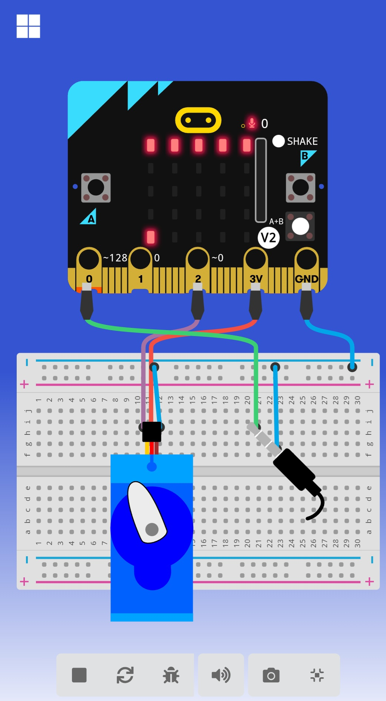

projekt:

> Az oldal megnyitása itt: [https://lacko186.github.io/micro/](https://lacko186.github.io/micro/)

## Használj egy bővítményt

Ez a repó **bővítményként** használható a MakeCode-ban.

* [https://makecode.microbit.org/](https://makecode.microbit.org/) megnyitása
* kattints au **Új projekt**-re
* kattints a **Bővítmények** gombra a fogaskerék menüben
* **https://github.com/lacko186/micro** keresése, majd importálás

## A projekt szerkesztése

A repó szerkesztése a MakeCode-ban.

* [https://makecode.microbit.org/](https://makecode.microbit.org/) megnyitása
* kattints az **Import**-ra, utána az **Import URL**-re
* illeszd be a **https://github.com/lacko186/micro** címet és kattints az importra

#### Metaadatok (kereséshez, rendereléshez)

* for PXT/microbit

